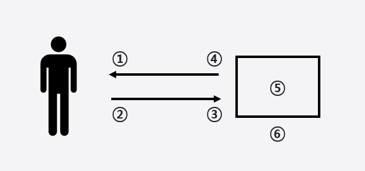

# Frontend-Oriented-Foundation-Knowledge

#### Inspired by - [테오의 프론트엔드](https://yozm.wishket.com/magazine/detail/1294/)

1. 데이터를 예쁘게 잘 보여주기
2. 데이터(화면)를 조작하기
3. 서버로 데이터 보내기
4. 서버에서 받은 데이터를 다루기
5. 개발환경 관리하기, 서버로 배포하기
6. 개발자들을 위한 개발

<!--
1. Git
2. Regexp
3. Authority
   - jwt
   - cookie
   - session
4. Design Pattern
   - OOP
   - FP
5. Network
   - Lazy loading
   - Async
6. Framework
   - React
7. Browser
   - Event loop
-->
